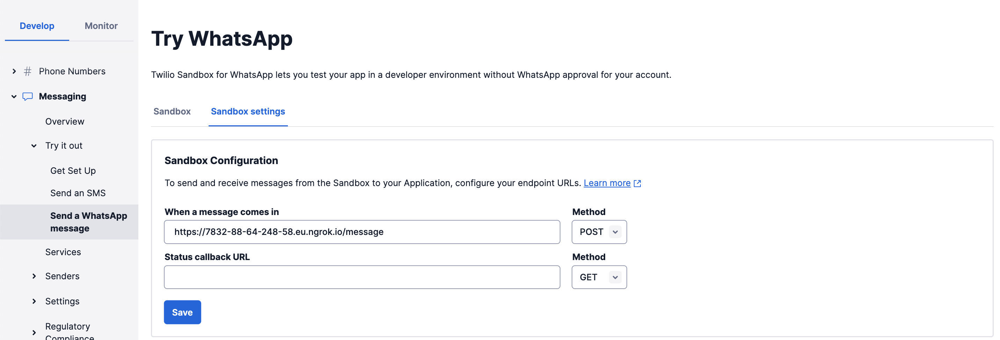

 
 
 

# Grandma communication 👵🏼

GrandmaBot is a whatsapp tool that enables easy communication with people who cannot use whatsapp and prefer pen and paper. Share your thoughts via voice message and grandma bot will summarise them as a letter and send it to your loved one by mail.

# About

GrandmaBot uses the [Twilio](https://www.google.com/search?q=twilio+api+whatsapp) for messaging via whatsapp, [Whisper](https://github.com/openai/whisper) for transcription, and GPT for summarisation.

# Feature roadmap

## Current priority

- [x] Add database for incoming messages
- [ ] Have a working MVP for a single voice memo
- [ ] Allow user to select multiple messages
- [ ] User can manually change message and send it back for mailing
- [ ] Add mailing feature

## Future

- [ ] User signup
- [ ] User can add photos to message
- [ ] Chat interface so that user can make suggestions to previous text
- [ ] Move to a container based setup
- [ ] Write flask tests
- [ ] Configure launch.json file for faster debugging requests (flask app is launched and then another script is called)
- [ ] Add encryption to database?
- [ ] Refactor database to use SLQalchemy

# Installation / setup instructions

If you want to run the app yourself then follow these instructions.

First, create a [Twilio](https://www.google.com/search?q=twilio+api+whatsapp) account. This is free initially. Add your Account SID and Auth Token to the .env file in the directory. Have a look at the example .env file to see what else you need to add.

You will need Ngrok to interact with the app from whatsapp while you're running it locally. You can find installation instructions [here](https://ngrok.com/docs/getting-started/). Run the following command to start Ngrok.

`ngrok http 5000`

In your Twilio account, add the url provided by twilio, followed by a `/message` to the Sandbox Configuration post-request address.

Run the database using docker-compose. This command will pull the necessary images and start the containers in the background. Run without -d to start the container in the foreground. 

`docker-compose up -d`  

### GCP

Memos and pdfs can be stored locally, but to send attachments to users via twilio the respective attachment needs to be made available at a publicly accessible url at least for a short time. Since this is not possible with local files you need at least some online solution. This repo uses GCP. You can of course implement another solution but for now GCP presumably is the easiest way to get the repo running as the code is alraedy implemented.

Create service account credentials using the instructions [here](https://cloud.google.com/iam/docs/keys-create-delete#iam-service-account-keys-create-console) and place them in the server folder.

Set the `GOOGLE_APPLICATION_CREDENTIALS`environment variable to the location of your json file. 

You can see alterntive options for authentication, such as using your console to grant automatic access for apps running on your computer (not docker) [here](https://cloud.google.com/docs/authentication/provide-credentials-adc#how-to).

# Pinned resources

Some links to resources that I frequently access during development

- [docker compose documentation](https://docs.docker.com/engine/reference/commandline/compose_up/)
- [Black code formatting docs](https://black.readthedocs.io/en/stable/getting_started.html)
- [python-mariadb-connector](https://www.digitalocean.com/community/tutorials/how-to-store-and-retrieve-data-in-mariadb-using-python-on-ubuntu-18-04)
- [pigar](https://github.com/damnever/pigar) for creation of requirements.txt files `pigar gen -f docker/server/requirements.txt docker/server`

# Some learnings 

Check own code for security issues
`bandit example.py`
`bandit -r .`

Check packages for security issues
`safety check`
`safety check --full-report`